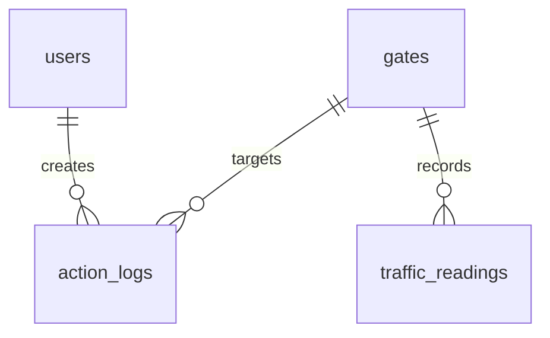

# Database Schema

## Entity Relationship Diagram

## Tables

### users
Stores user accounts for accessing the dashboard.
- **id**: `SERIAL PRIMARY KEY`
- **name**: `VARCHAR(255) NOT NULL`
- **email**: `VARCHAR(255) UNIQUE NOT NULL`
- **password_hash**: `VARCHAR(255) NOT NULL`
- **role**: `VARCHAR(50)` (Security Staff, Administrator, Viewer)
- **created_at**: `TIMESTAMP WITH TIME ZONE`
- **updated_at**: `TIMESTAMP WITH TIME ZONE`

### gates
Stores information about campus gates monitored by the system.
- **id**: `VARCHAR(50) PRIMARY KEY`
- **name**: `VARCHAR(100) NOT NULL`
- **type**: `VARCHAR(50)`
- **status**: `VARCHAR(50)` (Open, Closed, Available, Restricted)
- **capacity_rate**: `INTEGER`
- **current_flow**: `INTEGER`
- **is_emergency**: `BOOLEAN`
- **last_updated**: `TIMESTAMP WITH TIME ZONE`

### traffic_readings
Stores telemetry data (either simulated or AI-generated).
- **id**: `SERIAL PRIMARY KEY`
- **gate_id**: `VARCHAR(50)` (Foreign Key to gates)
- **vehicle_count**: `INTEGER`
- **cars**: `INTEGER`
- **bikes**: `INTEGER`
- **buses**: `INTEGER`
- **vans**: `INTEGER`
- **average_speed**: `NUMERIC(5,2)`
- **queue_length**: `INTEGER`
- **waiting_time**: `NUMERIC(5,2)`
- **congestion_score**: `INTEGER`
- **traffic_level**: `VARCHAR(20)`
- **is_simulated**: `BOOLEAN`
- **timestamp**: `TIMESTAMP WITH TIME ZONE`

### alerts
Stores system alerts for congestion, anomalies, or system issues.
- **id**: `SERIAL PRIMARY KEY`
- **severity**: `VARCHAR(20)`
- **title**: `VARCHAR(255)`
- **description**: `TEXT`
- **location**: `VARCHAR(100)`
- **recommended_action**: `TEXT`
- **status**: `VARCHAR(20)`
- **is_simulated**: `BOOLEAN`
- **created_at**: `TIMESTAMP WITH TIME ZONE`
- **acknowledged_at**: `TIMESTAMP WITH TIME ZONE`
- **resolved_at**: `TIMESTAMP WITH TIME ZONE`
- **acknowledged_by**: `VARCHAR(255)`
- **resolved_by**: `VARCHAR(255)`

### ai_predictions
Stores AI-generated predictions for future congestion.
- **id**: `SERIAL PRIMARY KEY`
- **prediction**: `VARCHAR(100)`
- **timeframe**: `VARCHAR(50)`
- **confidence**: `INTEGER`
- **risk_level**: `VARCHAR(20)`
- **explanation**: `TEXT`
- **recommended_lane_action**: `VARCHAR(255)`
- **is_simulated**: `BOOLEAN`
- **timestamp**: `TIMESTAMP WITH TIME ZONE`

### action_logs
Stores audit logs of user actions.
- **id**: `SERIAL PRIMARY KEY`
- **user_id**: `INTEGER` (Foreign Key to users)
- **user_name**: `VARCHAR(255)`
- **action**: `VARCHAR(255)`
- **gate_id**: `VARCHAR(50)`
- **details**: `TEXT`
- **is_simulated**: `BOOLEAN`
- **timestamp**: `TIMESTAMP WITH TIME ZONE`

### field_observations
Stores manual field observations recorded by staff.
- **id**: `SERIAL PRIMARY KEY`
- **location**: `VARCHAR(255)`
- **observation_date**: `DATE`
- **duration_minutes**: `INTEGER`
- **total_vehicles**: `INTEGER`
- **max_queue_length**: `INTEGER`
- **average_waiting_time**: `NUMERIC(5,2)`
- **peak_period**: `VARCHAR(100)`
- **notes**: `TEXT`
- **photo_url**: `TEXT`
- **video_reference**: `TEXT`
- **verified**: `BOOLEAN`
- **created_at**: `TIMESTAMP WITH TIME ZONE`
